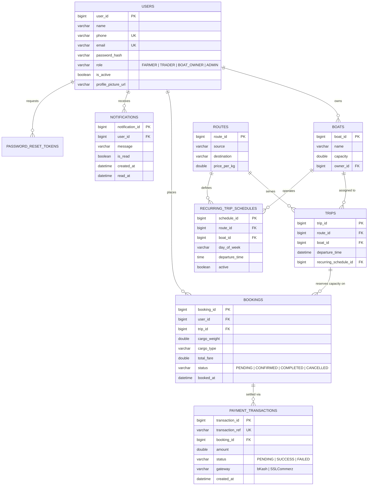

# 🚢 NoboGhat (নোবো ঘাট) - River Cargo Booking Platform

[](https://spring.io/projects/spring-boot)
[](https://www.oracle.com/java/)
[](https://www.mysql.com/)
[](https://spring.io/guides/gs/messaging-stomp-websocket/)
[](https://developer.mozilla.org/en-US/docs/Web/JavaScript)
[](https://render.com)

> **NoboGhat** (নোবো ঘাট - *"The New River Port"*) is a full-stack, enterprise-grade river logistics and cargo booking platform engineered to digitize and optimize inland waterway freight transportation across Bangladesh. It seamlessly connects cargo providers (farmers, agricultural producers, and commercial traders) with vessel operators (boat owners) through real-time capacity-aware scheduling, secure transactions, and administrative governance.

---

## 🌐 Live Deployments

- **Frontend Application (Vercel):** [https://noboghat-bangladesh.vercel.app](https://noboghat-bangladesh.vercel.app)
- **Backend REST & WebSocket API (Render):** [https://noboghat-bangladesh.onrender.com](https://noboghat-bangladesh.onrender.com)
- **API Health Check:** [https://noboghat-bangladesh.onrender.com/actuator/health](https://noboghat-bangladesh.onrender.com/actuator/health)

---

## 📋 Table of Contents

- [Core Problem & Solution](#-core-problem--solution)
- [Key Features](#-key-features)
- [System Architecture](#-system-architecture)
- [Technology Stack](#-technology-stack)
- [Database Schema & Data Model](#-database-schema--data-model)
- [Project Directory Structure](#-project-directory-structure)
- [REST API Reference](#-rest-api-reference)
- [Real-Time WebSocket System](#-real-time-websocket-system)
- [Security & Authentication](#-security--authentication)
- [Getting Started & Local Development](#-getting-started--local-development)
- [Production Deployment](#-production-deployment)
- [Troubleshooting & FAQs](#-troubleshooting--faqs)

---

## 🎯 Core Problem & Solution

### The Challenge
Inland water transport carries millions of tons of agricultural produce and industrial goods daily across Bangladesh's extensive river network. Traditionally, this sector has operated via informal, fragmented communication channels:
- **Cargo Providers** (farmers and traders) suffer from erratic vessel availability, unfair broker markups, and lack of schedule transparency.
- **Boat Owners** frequently experience underutilized hold capacity, empty return legs, and unpredictable booking flows.
- **Logistics Managers** lack unified analytics on river corridor demand, freight volume, and safety compliance.

### The NoboGhat Solution
NoboGhat establishes a centralized, digital river logistics network:
1. **Dynamic Capacity Management:** Real-time pessimistic database locking prevents boat overbooking down to the exact kilogram.
2. **Dynamic Fare Computation:** Corridor-based pricing calculating trip cost automatically (`Cargo Weight (kg) × Route Price per kg`).
3. **Role-Based Workflows:** Tailored interfaces and capabilities for Farmers, Traders, Boat Owners, and Administrators.
4. **Real-Time Notification Pipeline:** STOMP-over-WebSocket broadcasts status updates, schedule revisions, and booking confirmations instantly.
5. **Resilient Dual-Authentication:** JWT bearer tokens with sliding-session HttpOnly cookie refresh, plus Google OAuth2 integration.

---

## ✨ Key Features

### 👤 Role-Based Portals & Capabilities
- **🌾 Farmers & Traders:**
  - Search scheduled river voyages by source port, destination port, and departure date.
  - Inspect vessel remaining payload capacity before booking.
  - Reserve cargo space with instant automated fare estimation.
  - Track booking lifecycle (`PENDING` ➔ `CONFIRMED` ➔ `COMPLETED` / `CANCELLED`).
  - Initiate payments and download booking receipts.
  - Switch operational roles on-demand from profile settings.
- **⛵ Boat Owners:**
  - Register and manage vessel fleets (name, dimensions, maximum tonnage/capacity).
  - Schedule one-off journeys or define automated recurring weekly sailing timetables.
  - View manifest of booked cargo and manage incoming reservation requests.
  - Track fleet utilization and cargo tonnage.
- **🛡️ Administrators:**
  - Comprehensive operational dashboard with live system metrics and freight totals.
  - Complete control over navigational waterways/routes and price-per-kg tariffs.
  - User lifecycle management (moderation, account deactivation, role elevation).
  - System-wide trip scheduling, cancellation, and booking status overrides.

### ⚡ Architectural & Technical Highlights
- **Pessimistic Concurrency Control:** Uses `LockModeType.PESSIMISTIC_WRITE` on trip entities during reservation transactions to guarantee zero overbooking under high concurrent load.
- **Sliding Refresh Token Lifecycle:** Seamless UX where client interceptor silently renews expired 15-minute JWT access tokens using secure HttpOnly refresh cookies without interrupting user tasks.
- **Interactive Waterway Route Explorer:** Live visual route map and timetable browser with dynamic price calculations.
- **Avatar & Document Storage:** Built-in multipart file storage engine for profile pictures and cargo paperwork.
- **Production Telemetry:** Integrated Spring Boot Actuator health probes, Prometheus metrics exporter, and Sentry error tracking.

---

## 🏗 System Architecture

NoboGhat is structured as a decoupled, multi-tiered enterprise web application:

```
┌─────────────────────────────────────────────────────────────────────────────┐
│                             CLIENT LAYER (BROWSER)                          │
│                                                                             │
│   Semantic HTML5  •  Vanilla CSS Design System  •  Modular ES6+ JavaScript  │
│   [api.js (Interceptor)] ── [session.js] ── [websocket.js (STOMP Client)]   │
└───────────────────────┬─────────────────────────────────┬───────────────────┘
                        │ HTTPS (REST JSON)               │ WSS (STOMP/SockJS)
                        ▼                                 ▼
┌─────────────────────────────────────────────────────────────────────────────┐
│                    APPLICATION LAYER (SPRING BOOT 4.1.0)                    │
│                                                                             │
│   ┌─────────────────────────────────────────────────────────────────────┐   │
│   │                        Security Filter Chain                        │   │
│   │   CorsFilter ➔ JwtRequestFilter ➔ DaoAuthProvider ➔ OAuth2Login     │   │
│   └──────────────────────────────────┬──────────────────────────────────┘   │
│                                      ▼                                      │
│   ┌─────────────────────────────────────────────────────────────────────┐   │
│   │                          Controller Layer                           │   │
│   │   AuthController • TripController • BookingController • BoatCtrl    │   │
│   │   AdminController • RouteController • NotificationCtrl • FileCtrl   │   │
│   └──────────────────────────────────┬──────────────────────────────────┘   │
│                                      ▼                                      │
│   ┌─────────────────────────────────────────────────────────────────────┐   │
│   │                      Service Layer (Business Logic)                 │   │
│   │   BookingService (Pessimistic Locks) • TripService • UserService    │   │
│   │   NotificationService (WebSocket Push) • PaymentService • FileStore │   │
│   └──────────────────────────────────┬──────────────────────────────────┘   │
│                                      ▼                                      │
│   ┌─────────────────────────────────────────────────────────────────────┐   │
│   │                 Data Access Layer (Spring Data JPA)                 │   │
│   │   UserRepository • TripRepository • BookingRepository • BoatRepo    │   │
│   └──────────────────────────────────┬──────────────────────────────────┘   │
└──────────────────────────────────────┼──────────────────────────────────────┘
                                       │ JDBC / Hibernate ORM
                                       ▼
┌─────────────────────────────────────────────────────────────────────────────┐
│                              PERSISTENCE LAYER                              │
│                                                                             │
│   Production: MySQL 8.0+ (InnoDB, UTF-8mb4)                                 │
│   Local Dev:  Auto-detected MySQL 8.0+ or In-Memory H2 Engine               │
└─────────────────────────────────────────────────────────────────────────────┘
```

---

## 🛠 Technology Stack

| Domain | Technology / Library | Description |
|---|---|---|
| **Backend Framework** | Spring Boot `4.1.0` | Core enterprise application platform |
| **Runtime Environment**| Java `21 LTS` / `25` | Modern JVM runtime with virtual threads support |
| **Security & Auth** | Spring Security, JJWT `0.12.6`, BCrypt | Stateless JWT auth, OAuth2, and role RBAC |
| **Database & ORM** | Spring Data JPA, Hibernate 6, MySQL 8 | Relational persistence with connection pooling |
| **Connection Pool** | HikariCP | High-performance JDBC connection management |
| **Real-Time Push** | Spring WebSocket, STOMP, SockJS | Bi-directional pub-sub messaging broker |
| **Frontend Core** | HTML5, Vanilla CSS3, JavaScript ES6+ | Lightweight, fast, zero-bloat user experience |
| **Monitoring & Ops** | Spring Boot Actuator, Micrometer Prometheus | Production health checks and performance metrics |
| **Containerization** | Docker Multi-Stage Build (`eclipse-temurin:21`)| Optimized, secure production container image |
| **Cloud Hosting** | Render (Backend) & Vercel (Frontend) | Scalable production cloud infrastructure |

---

## 🗄 Database Schema & Data Model

The data model uses a normalized relational architecture with JPA single-table inheritance for user types.



---

## 📁 Project Directory Structure

```
NoboGhat/
├── backend/                             # Spring Boot REST & WebSocket API
│   ├── src/main/java/com/noboghat/mahi/
│   │   ├── config/                      # WebSockets, Cache, Async, DataSeeder
│   │   ├── controller/                  # REST Controllers (/api/*)
│   │   ├── dto/                         # Request/Response Data Transfer Objects
│   │   ├── model/                       # JPA Entities (User, Boat, Trip, Booking, etc.)
│   │   ├── repository/                  # Spring Data JPA Repositories
│   │   ├── security/                    # SecurityConfig, JWT Filter, OAuth2 Handler
│   │   └── service/                     # Business Logic (BookingService, TripService, etc.)
│   ├── src/main/resources/
│   │   ├── application.properties       # Core Spring Configuration & Environment Bindings
│   │   └── db/migration/                # Database Migration Scripts
│   ├── .env.example                     # Environment variables template
│   ├── Dockerfile                       # Production multi-stage container build
│   └── pom.xml                          # Maven build descriptors & dependencies
├── frontend/                            # Framework-free Modern Client Application
│   ├── index.html                       # Landing Page & Public Voyage Search
│   ├── pages/
│   │   ├── login.html                   # Dual Sign-in (Local Phone + Google OAuth)
│   │   ├── register.html                # Multi-role User Registration
│   │   ├── dashboard.html               # Unified User Dashboard (Farmer, Trader, Boat Owner)
│   │   ├── admin.html                   # Administrative Operations Dashboard
│   │   ├── routes.html                  # Interactive River Corridor Explorer & Timetable
│   │   └── about.html                   # Platform Mission & Logistics Network Details
│   └── assets/
│       ├── css/                         # Custom CSS Design System, Components & Animations
│       ├── js/
│       │   ├── config.js                # Environment backend URL configuration
│       │   ├── api.js                   # Fetch wrapper with auto-refresh token interceptor
│       │   ├── session.js               # LocalStorage & Session state management
│       │   ├── websocket.js             # STOMP/SockJS real-time toast notification client
│       │   ├── auth.js                  # Authentication, login, register, password reset
│       │   ├── dashboard.js             # Booking management, fleet control, capacity UI
│       │   ├── admin.js                 # Admin metrics, user moderation, route creation
│       │   └── routes.js                # Route explorer, trip filtering, booking modal
│       └── images/                      # SVGs, icons, river vessel illustrations
├── docs/                                # Project Documentation & Architecture Guides
│   ├── ARCHITECTURE.md                  # High-level architecture blueprint
│   ├── GOOGLE_LOGIN_SETUP.md            # Google Cloud OAuth2 setup instructions
│   └── PRESENTATION_NOTES.md            # Demonstration walkthrough & presenter guide
├── render.yaml                          # Render Cloud blueprint for Docker deployment
└── README.md                            # Comprehensive Project Documentation (This file)
```

---

## 🔌 REST API Reference

All protected endpoints require an `Authorization: Bearer <JWT_TOKEN>` header.

### 1. Authentication & Account Management (`/api/auth`)
| Method | Endpoint | Access | Description |
|---|---|---|---|
| `POST` | `/api/auth/register` | Public | Register new user (`name, phone/email, password, role`) |
| `POST` | `/api/auth/login` | Public | Authenticate user; returns JWT + sets Refresh Cookie |
| `POST` | `/api/auth/refresh` | Public | Rotates expired access token using HttpOnly cookie |
| `POST` | `/api/auth/forgot-password` | Public | Initiates password reset token generation |
| `POST` | `/api/auth/reset-password` | Public | Validates token and resets account password |

### 2. User Profile & Role Elevation (`/api/users`)
| Method | Endpoint | Access | Description |
|---|---|---|---|
| `GET` | `/api/users/profile` | Authenticated | Retrieve authenticated user profile |
| `PUT` | `/api/users/profile` | Authenticated | Update profile details and avatar URL |
| `PUT` | `/api/users/update-role` | Authenticated | Switch active role (`FARMER`, `TRADER`, `BOAT_OWNER`) |
| `DELETE`| `/api/users/profile` | Authenticated | Soft deactivate current user account |

### 3. Trips & Vessel Schedules (`/api/trips`)
| Method | Endpoint | Access | Description |
|---|---|---|---|
| `GET` | `/api/trips` | Public | List voyages with dynamic real-time capacity remaining |
| `GET` | `/api/trips?source=X&destination=Y&date=Z` | Public | Search voyages with corridor and date filters |
| `POST` | `/api/trips` | Boat Owner / Admin | Create a new scheduled journey |
| `DELETE`| `/api/trips/{id}` | Boat Owner / Admin | Delete/Cancel a scheduled voyage |

### 4. Cargo Bookings (`/api/bookings`)
| Method | Endpoint | Access | Description |
|---|---|---|---|
| `POST` | `/api/bookings` | Farmer / Trader | Create cargo reservation with pessimistic capacity check |
| `GET` | `/api/bookings` | Authenticated | Fetch bookings scoped to authenticated user or boat fleet |
| `GET` | `/api/bookings/{id}` | Authenticated | Get detailed booking receipt |
| `PATCH`| `/api/bookings/{id}/status` | Boat Owner / Admin | Update booking status (`CONFIRMED`, `COMPLETED`, `CANCELLED`)|
| `DELETE`| `/api/bookings/{id}` | Authenticated | Cancel pending booking and release held capacity |

### 5. Fleet & Vessels (`/api/boats`)
| Method | Endpoint | Access | Description |
|---|---|---|---|
| `GET` | `/api/boats` | Authenticated | List all boats (or fleet owned by user) |
| `POST` | `/api/boats` | Boat Owner / Admin | Register new boat vessel |
| `PUT` | `/api/boats/{id}` | Boat Owner / Admin | Update boat specifications and capacity |
| `DELETE`| `/api/boats/{id}` | Boat Owner / Admin | Remove vessel from service |

### 6. River Corridors & Routes (`/api/routes`)
| Method | Endpoint | Access | Description |
|---|---|---|---|
| `GET` | `/api/routes` | Public | List all active navigable river corridors and tariffs |
| `POST` | `/api/routes` | Admin | Register a new river route with price-per-kg |

### 7. Real-Time Notifications (`/api/notifications`)
| Method | Endpoint | Access | Description |
|---|---|---|---|
| `GET` | `/api/notifications` | Authenticated | Fetch notifications for logged-in user |
| `GET` | `/api/notifications/unread-count` | Authenticated | Fetch count of unread notifications |
| `PUT` | `/api/notifications/{id}/read` | Authenticated | Mark notification as read |

### 8. Payments & Webhooks (`/api/payments`)
| Method | Endpoint | Access | Description |
|---|---|---|---|
| `POST` | `/api/payments/initiate` | Farmer / Trader | Generate payment transaction reference |
| `POST` | `/api/payments/webhook` | Public | Process payment gateway settlement notification |

### 9. File Uploads (`/api/files`)
| Method | Endpoint | Access | Description |
|---|---|---|---|
| `POST` | `/api/files/upload` | Authenticated | Upload user avatar or shipping document |
| `GET` | `/api/files/{fileName}` | Public | Download stored file asset |

### 10. Administrative Management (`/api/admin`)
| Method | Endpoint | Access | Description |
|---|---|---|---|
| `GET` | `/api/admin/dashboard` | Admin | Fetch system analytics (Users, Boats, Bookings, Cargo Weight) |
| `GET` | `/api/admin/users` | Admin | List all registered accounts with status & roles |
| `DELETE`| `/api/admin/users/{id}` | Admin | Delete a user account |
| `GET` | `/api/admin/recurring-trips`| Admin | List automated weekly recurring schedules |
| `POST` | `/api/admin/recurring-trips`| Admin | Create automated recurring voyage schedule |

---

## ⚡ Real-Time WebSocket System

NoboGhat incorporates a reactive STOMP messaging broker over SockJS at endpoint `/ws`.

- **Client Subscription:** `/topic/notifications/{userId}`
- **Trigger Events:**
  - Booking confirmed or status updated by vessel owner.
  - New cargo reservation placed on a boat owner's scheduled voyage.
  - Automated weekly trip instance generated.
- **Frontend Behavior:** `websocket.js` intercepts messages and dynamically renders non-intrusive floating toast alerts and updates unread notification counters.

---

## 🔐 Security & Authentication

### Multi-Layer Security Architecture
1. **Password Protection:** Passwords are never stored in plaintext; hashed using `BCryptPasswordEncoder` (10 rounds).
2. **Stateless JWT Tokens:** 
   - **Access Token:** Compact HMAC-SHA256 token containing user identifier and role authorities (valid for 24h configurable).
   - **Refresh Token:** Stored in a secure, `HttpOnly`, `SameSite=Strict` cookie (valid for 7 days) to enable silent background token rotation.
3. **Pessimistic Concurrency Locking:**
   ```java
   @Lock(LockModeType.PESSIMISTIC_WRITE)
   @Query("SELECT t FROM Trip t WHERE t.tripId = :tripId")
   Optional<Trip> findByIdWithLock(@Param("tripId") Long tripId);
   ```
   Prevents race conditions where two simultaneous bookings could exceed maximum vessel payload.
4. **CORS Hardening:** Configurable origins whitelist with automatic development and production Vercel preview matching.
5. **IDOR & Role Isolation:** Non-admin endpoints enforce that users can only view, update, or cancel their own bookings, vessels, and profile data.

---

## 🚀 Getting Started & Local Development

### Prerequisites
- **Java Development Kit (JDK):** Version 21 LTS or newer
- **Maven:** 3.8+ (or use the included `./mvnw` wrapper)
- **Database:** MySQL 8.0+ *(Optional: The application automatically falls back to an in-memory H2 database for zero-config instant local development if MySQL is not running)*.

### Step 1: Clone Repository
```bash
git clone https://github.com/EHMahi9/NoboGhat-Bangladesh.git
cd NoboGhat
```

### Step 2: Configure Environment
Navigate to `backend/` and copy the example environment configuration:
```bash
cd backend
cp .env.example .env
```
*(Optional)* Edit `backend/.env` to point to your local MySQL instance:
```properties
DB_URL=jdbc:mysql://localhost:3306/noboghat?createDatabaseIfNotExist=true&useSSL=false&allowPublicKeyRetrieval=true
DB_USERNAME=root
DB_PASSWORD=yourpassword
JWT_SECRET=YourSuperSecretKeyWithAtLeast32CharactersLong!
```

### Step 3: Run the Backend
```bash
# On Linux / macOS
./mvnw spring-boot:run

# On Windows PowerShell
.\mvnw.cmd spring-boot:run
```
The backend will initialize, auto-seed default demo accounts, routes, vessels, and start on `http://localhost:8080`.

### Step 4: Run the Frontend
In a new terminal window:
```bash
cd frontend

# Using Python 3 built-in web server
python -m http.server 5500

# Or using Node.js http-server
npx http-server -p 5500
```
Open your browser and navigate to: `http://localhost:5500`

### 🔑 Demo Accounts (Pre-Seeded)
| Role | Phone | Password |
|---|---|---|
| **Administrator** | `01700000000` | `admin123` |
| **Boat Owner** | `01711111111` | `owner123` |
| **Farmer** | `01722222222` | `farmer123` |
| **Trader** | `01733333333` | `trader123` |

---

## ☁️ Production Deployment

### Backend Deployment (Render / Docker)
The project includes a ready-to-deploy [`render.yaml`](./render.yaml) blueprint and optimized [`Dockerfile`](./backend/Dockerfile).
1. Link your GitHub repository in Render.
2. Render detects `render.yaml` and provisions the Docker web service.
3. Configure environment variables in the Render Dashboard (`SPRING_DATASOURCE_URL`, `SPRING_DATASOURCE_USERNAME`, `SPRING_DATASOURCE_PASSWORD`, `JWT_SECRET`).

### Frontend Deployment (Vercel)
1. Import the repository into Vercel and set the Root Directory to `frontend`.
2. Ensure `frontend/assets/js/config.js` points to your active Render API URL:
   ```javascript
   window.NoboGhatConfig = {
       apiBaseUrl: "https://noboghat-bangladesh.onrender.com"
   };
   ```

---

## 🐛 Troubleshooting & FAQs

- **Q: Why does the backend start even if MySQL is not installed?**  
  **A:** `DatabaseSchemaMigrator` and H2 runtime dependencies detect when MySQL is unreachable locally and boot an in-memory SQL database automatically so developers can test immediately without database setup.
- **Q: I received a 401 Unauthorized error in API calls.**  
  **A:** JWT tokens expire after 24 hours. The frontend automatically attempts refresh token renewal. If the session has completely lapsed, simply re-authenticate via the login page.
- **Q: How does the system prevent double booking?**  
  **A:** `BookingService` executes a `PESSIMISTIC_WRITE` lock on the `Trip` row and computes `SUM(cargoWeight) WHERE status IN ('PENDING', 'CONFIRMED') + requestedWeight <= boat.capacity` inside a single atomic database transaction.

---

## 👥 Authors & Academic Context

- **Developer:** [EHMahi9](https://github.com/EHMahi9)
- **Course:** Desktop & Web Programming Lab (`SE 236`)
- **Institution:** Department of Software Engineering
- **Semester:** 6th Semester

---

**Project Status:** Active & Production Ready  
**License:** MIT License  
**Copyright:** © 2026 NoboGhat Logistics Bangladesh
